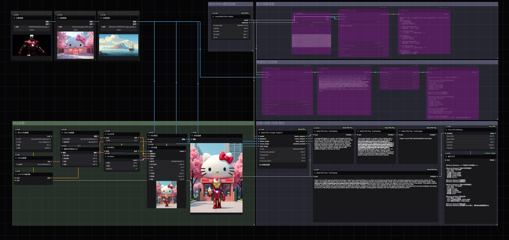

# ComfyUI-MiniCPM

[English](README_EN.md) | 简体中文

这是一个 ComfyUI 的自定义节点，用于在 ComfyUI 中使用 MiniCPM-o 的多模态能力。

还在增加这个节点的功能，希望能用这个模型实时音视频能力在ComfyUI里做一些有趣实用的事情。

当前支持的模型版本：MiniCPM-o 2.6 (2024年1月发布)




## 功能

### 单图i2t提示词反推。

可以选择预设的提示词或者自己输入提示词。


### 多图i2t提示词反推，输出融合后的提示词


## 安装步骤

### 方法一：使用 ComfyUI Manager（推荐）

1. 在 ComfyUI 中安装 [ComfyUI Manager](https://github.com/ltdrdata/ComfyUI-Manager)
2. 打开 ComfyUI，点击右上角的 "Manager" 标签
3. 在搜索框中输入 "MiniCPM-o"
4. 点击安装按钮完成安装

### 方法二：手动安装

1. 克隆此仓库到你的 ComfyUI 的 custom_nodes 文件夹下：
```bash
cd ComfyUI/custom_nodes
git clone https://github.com/CY-CHENYUE/ComfyUI-MiniCPM-o.git
```

2. 使用 ComfyUI 的 Python 安装依赖：

```bash
..\..\..\python_embeded\python.exe -m pip install -r requirements.txt
```

## 安装说明

1. 下载模型文件
   - 从 [Hugging Face模型仓库](https://huggingface.co/openbmb/MiniCPM-o-2_6) 下载 MiniCPM-o 2.6 模型文件

2. 放置模型文件
   - 将下载的模型文件放在 ComfyUI 的模型目录下：
   ```
   ComfyUI
   └── models
       └── MiniCPM
           └── MiniCPM-o-2_6
               ├── image_processing_minicpmv.py
               ├── configuration_minicpm.py
               ├── modeling_minicpmo.py
               └── 其他模型文件...
   ```

3. 模型文件结构
   - 确保所有必要的文件都在模型目录中
   - 不要修改文件结构和文件名

4. 注意在ComfyUI 的 Python 安装依赖


## Contact Me

- X (Twitter): [@cychenyue](https://x.com/cychenyue)
- TikTok: [@cychenyue](https://www.tiktok.com/@cychenyue)
- YouTube: [@CY-CHENYUE](https://www.youtube.com/@CY-CHENYUE)
- BiliBili: [@CY-CHENYUE](https://space.bilibili.com/402808950)
- 小红书: [@CY-CHENYUE](https://www.xiaohongshu.com/user/profile/6360e61f000000001f01bda0)

---