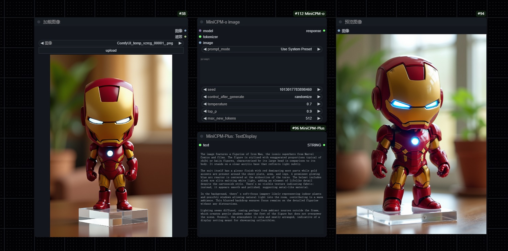
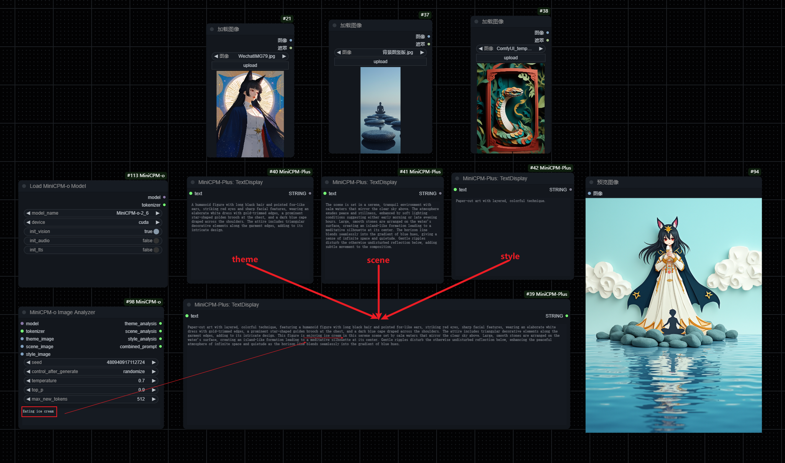

# ComfyUI-MiniCPM

English | [简体中文](README.md)

This is a custom node for ComfyUI that utilizes the multimodal capabilities of MiniCPM-o.

The node's functionality is still being expanded, with the goal of implementing real-time audio and video capabilities in ComfyUI to create interesting and practical applications.

Currently supported model version: MiniCPM-o 2.6 (Released January 2024)

## Features

### Single Image i2t Prompt Inference

You can choose from preset prompts or input your own prompts.



### Multi-Image i2t Prompt Inference

Outputs combined prompts from multiple images.



## Installation

### Method 1: Using ComfyUI Manager (Recommended)

1. Install [ComfyUI Manager](https://github.com/ltdrdata/ComfyUI-Manager) in ComfyUI
2. Open ComfyUI and click on the "Manager" tab in the top right
3. Search for "MiniCPM-o" in the search box
4. Click the install button to complete installation

### Method 2: Manual Installation

1. Clone this repository into your ComfyUI custom_nodes folder:
```bash
cd ComfyUI/custom_nodes
git clone https://github.com/CY-CHENYUE/ComfyUI-MiniCPM-o.git
```

2. Install dependencies using ComfyUI's Python:
```bash
..\..\..\python_embeded\python.exe -m pip install -r requirements.txt
```

## Installation Guide

1. Download Model Files
   - Download MiniCPM-o 2.6 model files from [Hugging Face Repository](https://huggingface.co/openbmb/MiniCPM-o-2_6)

2. Place Model Files
   - Put the downloaded model files in ComfyUI's model directory:
   ```
   ComfyUI
   └── models
       └── MiniCPM
           └── MiniCPM-o-2_6
               ├── image_processing_minicpmv.py
               ├── configuration_minicpm.py
               ├── modeling_minicpmo.py
               └── other model files...
   ```

3. Model File Structure
   - Ensure all necessary files are in the model directory
   - Do not modify the file structure or filenames

4. Remember to install dependencies using ComfyUI's Python

## Contact Me

- X (Twitter): [@cychenyue](https://x.com/cychenyue)
- TikTok: [@cychenyue](https://www.tiktok.com/@cychenyue)
- YouTube: [@CY-CHENYUE](https://www.youtube.com/@CY-CHENYUE)
- BiliBili: [@CY-CHENYUE](https://space.bilibili.com/402808950)
- Xiaohongshu: [@CY-CHENYUE](https://www.xiaohongshu.com/user/profile/6360e61f000000001f01bda0)

--- 